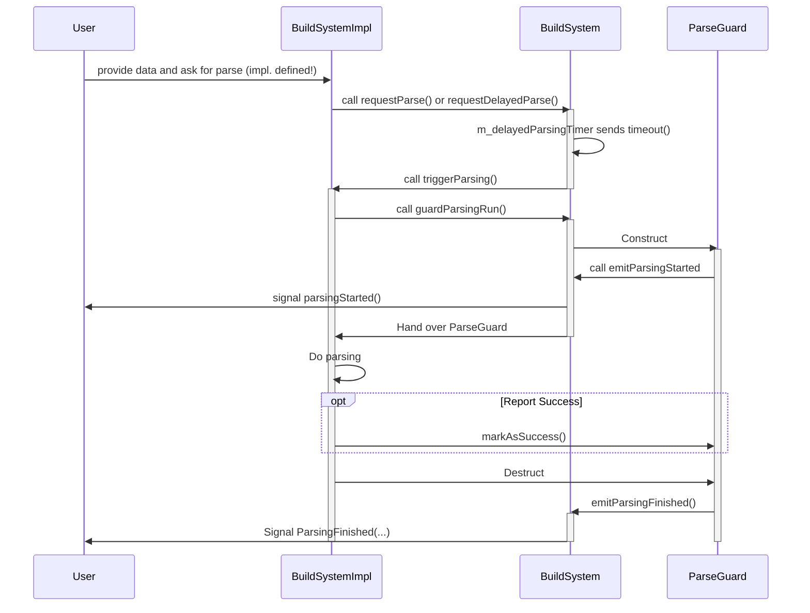

# BuildSystem

This is a sequence diagram of how ProjectExplorer::BuildSystem interacts with
its implementations:

```mermaid
sequenceDiagram
    User ->> BuildSystemImpl: provide data and ask for parse (impl. defined!)
    BuildSystemImpl ->> BuildSystem: call requestParse() or requestDelayedParse()
    activate BuildSystem
    BuildSystem ->> BuildSystem: m_delayedParsingTimer sends timeout()
    BuildSystem ->> BuildSystemImpl: call triggerParsing()
    deactivate BuildSystem
    activate BuildSystemImpl
    BuildSystemImpl ->> BuildSystem: call guardParsingRun()
    activate BuildSystem
    BuildSystem ->> ParseGuard: Construct
    activate ParseGuard
    ParseGuard ->> BuildSystem: call emitParsingStarted
    BuildSystem ->> User: signal parsingStarted()
    BuildSystem ->> BuildSystemImpl: Hand over ParseGuard
    deactivate BuildSystem
    BuildSystemImpl ->> BuildSystemImpl: Do parsing
    opt Report Success
    BuildSystemImpl ->> ParseGuard: markAsSuccess()
    end
    BuildSystemImpl ->> ParseGuard: Destruct
    ParseGuard ->> BuildSystem: emitParsingFinished()
    activate BuildSystem
    BuildSystem ->> User: Signal ParsingFinished(...)
    deactivate BuildSystem
    deactivate ParseGuard
    deactivate BuildSystemImpl
```
